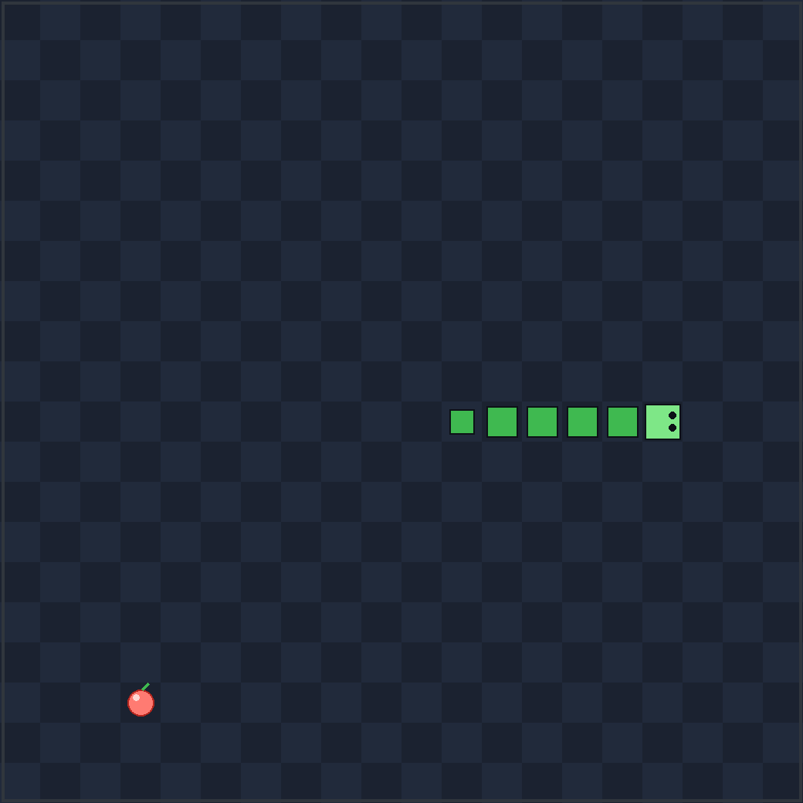

# 贪吃蛇小游戏

一个用 Python 写的贪吃蛇，界面基于 Python 自带的 tkinter，**不需要安装任何第三方库**。



## 运行

```bash
cd game
python snake.py
```

## 操作

| 按键 | 作用 |
| --- | --- |
| 方向键 / WASD | 控制方向（按方向键可直接开始） |
| 空格 | 暂停 / 继续 / 结束后重开 |
| R | 重新开始 |
| Esc | 退出 |

## 玩法

吃掉红色的小果子，蛇会变长、速度也会越来越快。撞墙或者咬到自己就结束。
历史最高分会自动保存在同目录的 `highscore.json` 里。

## 想改点什么

打开 `snake.py`，文件开头几个变量就能调：

- `CELL`：每格像素大小（窗口大小随之变化）
- `COLS` / `ROWS`：棋盘格数
- `BASE_INTERVAL`：初始速度，数值越小蛇走得越快
- 配色常量（`SNAKE_BODY`、`FOOD_BODY` 等）：改成你喜欢的颜色
